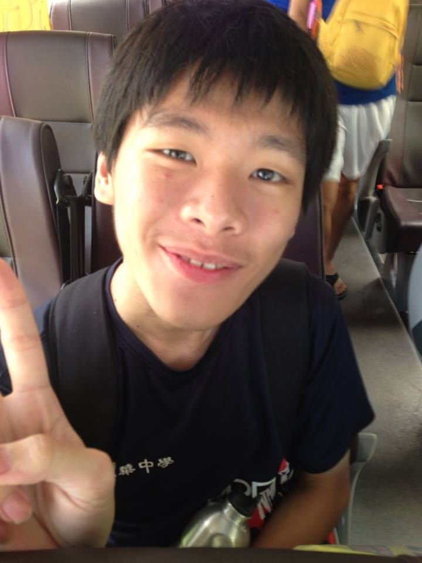
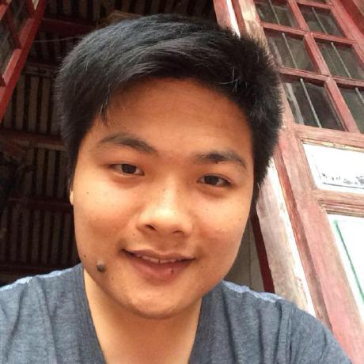
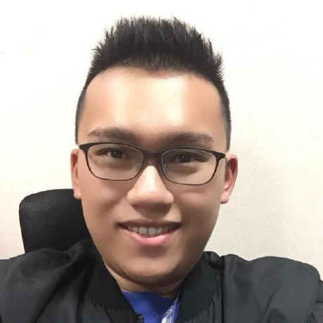

# About Us

We are a team based in the [School of Computing, National University of Singapore](http://www.comp.nus.edu.sg).

## Project Team

#### [Damith C. Rajapakse](http://www.comp.nus.edu.sg/~damithch)  
 
**Role**: Project Advisor

-----

#### [Chan Jun Wei]()
 
Role: Tutor    

-----

#### [Guo Shimin](https://github.com/shimin2016)
 
Role: Developer    
Responsibilities: UI

-----

#### [Eddie Tan Yong Sheng](https://github.com/e-tys) 
 
Role: Developer    
Responsibilities: Data

-----

#### [Antonia Devina](https://github.com/antoniadevina)
 
Role: Developer    
Responsibilities: Dev Ops

-----

#### [Jing Min](https://github.com/teojm37)
 
 Role: Developer    
 Responsibilities: Threading
 
 -----

# Contributors

We welcome contributions. See [Contact Us](ContactUs.md) page for more info.

* [Akshay Narayan](https://github.com/se-edu/addressbook-level4/pulls?q=is%3Apr+author%3Aokkhoy)
* [Sam Yong](https://github.com/se-edu/addressbook-level4/pulls?q=is%3Apr+author%3Amauris)